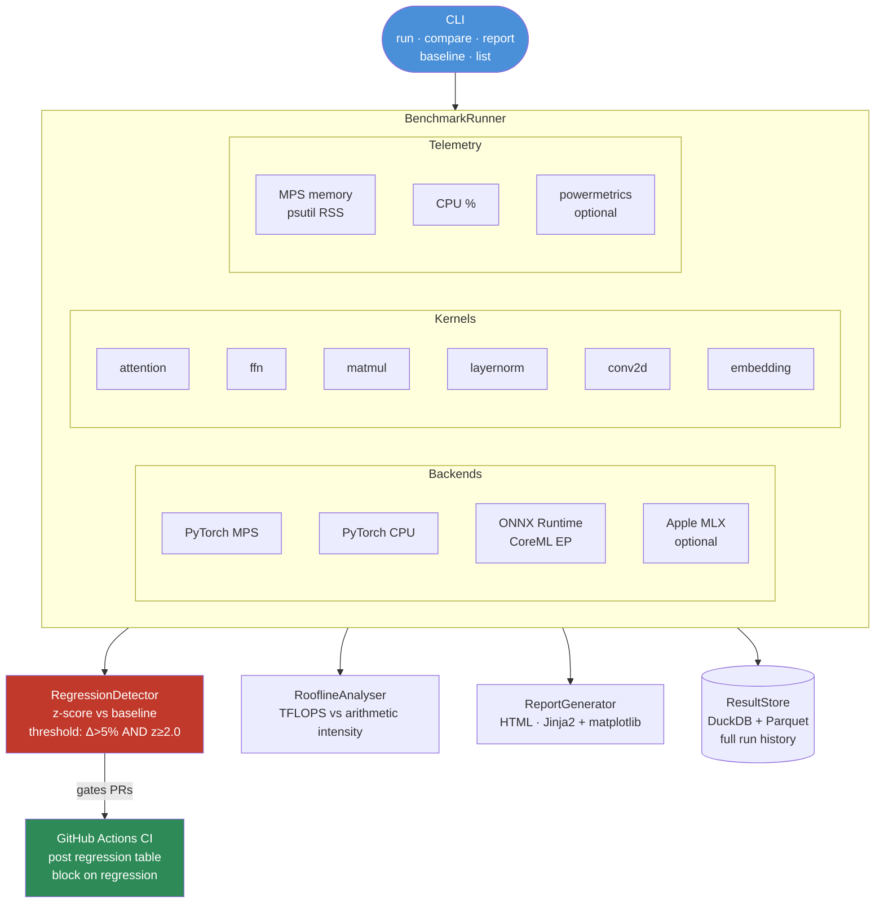
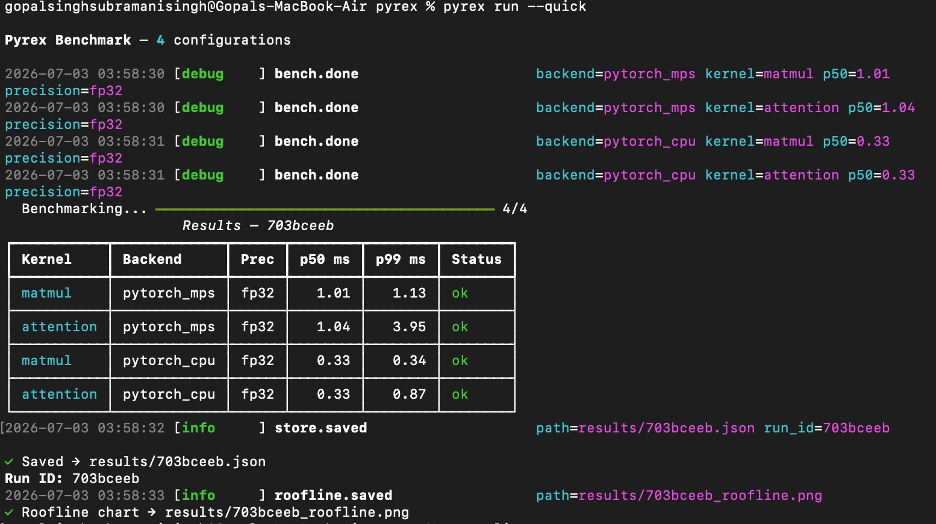
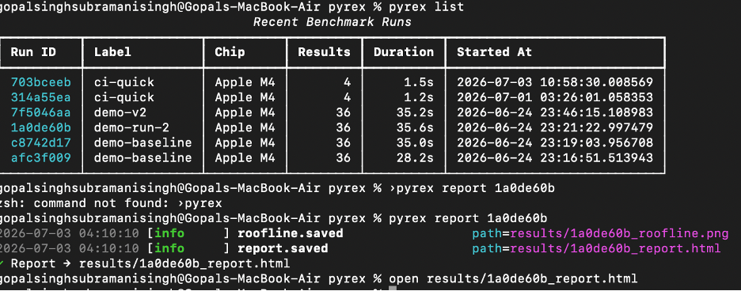
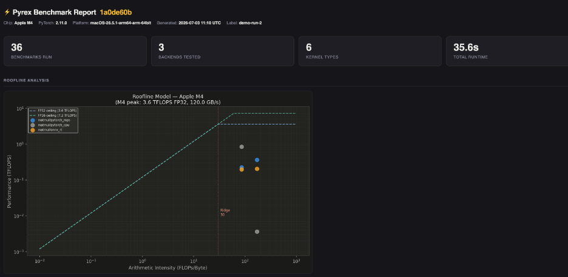
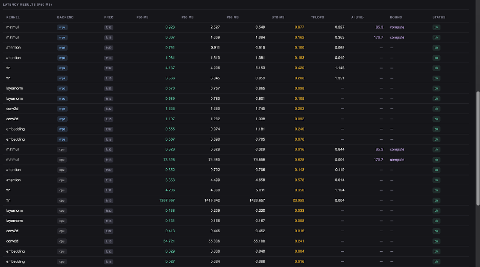
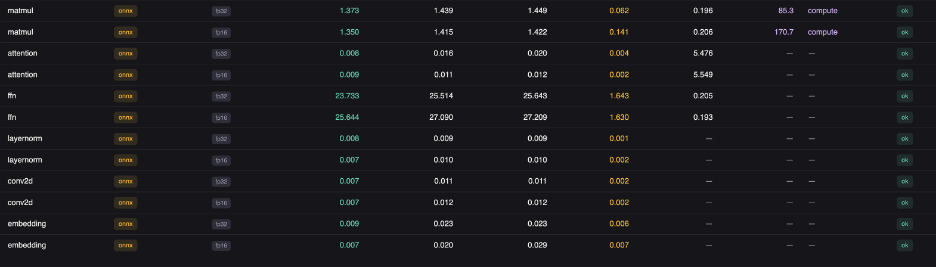
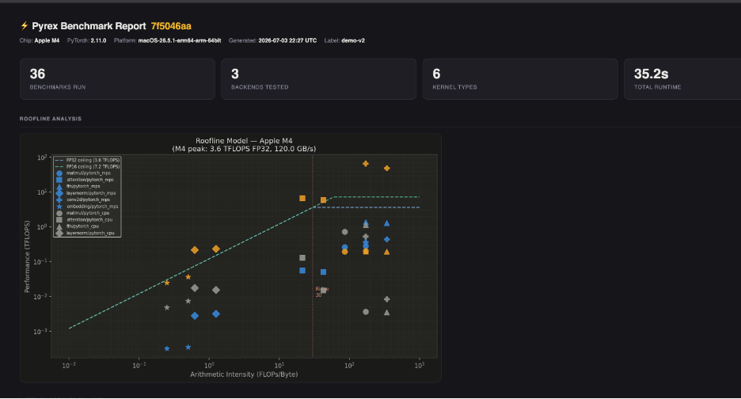
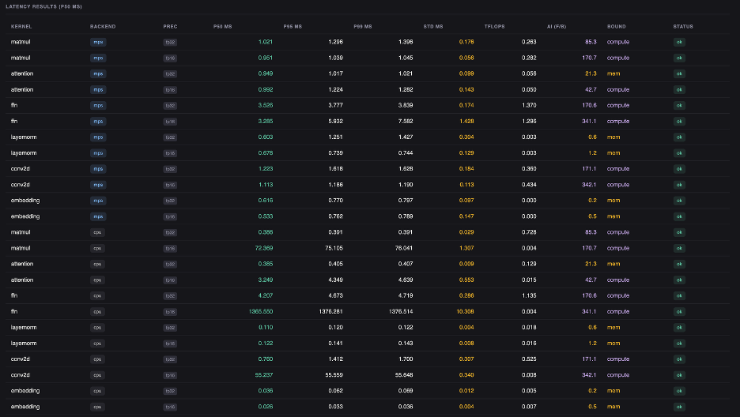
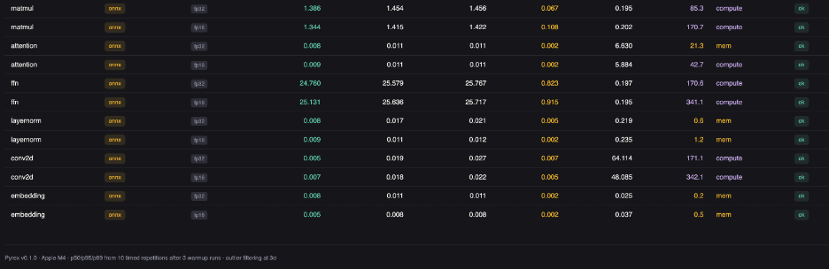

<p align="center">
  
</p>

<h1 align="center">Pyrex</h1>

<p align="center">
  <strong>Cross-Backend ML Inference Benchmark Suite</strong>
</p>

<p align="center">
  Systematic, CI-friendly benchmark harness for Apple Silicon inference across
  PyTorch MPS, ONNX Runtime, Apple MLX, and CPU.
</p>

<p align="center">
  
  
  
  
  
</p>

---

## Overview

**Pyrex** is a local-first ML inference benchmark suite for Apple Silicon.

It runs configurable benchmarks across multiple inference backends, kernel types, batch sizes, and precision modes. It measures latency, throughput, memory usage, and optional power telemetry, then stores benchmark history in DuckDB and generates standalone HTML reports.

Pyrex also supports baseline comparison and regression detection, making it suitable for CI workflows where performance changes need to be reviewed before merging code.

---

## Why It Matters

Inference performance on Apple Silicon depends heavily on backend and workload shape.

A backend that performs well for matrix multiplication may not be best for attention, layer normalization, embeddings, or convolution. Without repeatable benchmarking, performance optimization becomes anecdotal.

Pyrex treats inference performance as an engineering artifact:

* benchmarks are repeatable
* results are stored historically
* regressions are detected statistically
* reports are generated automatically
* CI can block pull requests with meaningful slowdowns

---

## Architecture



---

## Features

* **4 inference backends**: PyTorch MPS, PyTorch CPU, ONNX Runtime, and Apple MLX
* **6 benchmark kernels**: attention, FFN, matmul, layernorm, conv2d, and embedding
* **Batch size sweep** across configurable batch sizes
* **Precision sweep** for fp32 and fp16
* **Latency measurement** with p50, p95, and p99 summaries
* **Throughput tracking** for backend and kernel comparisons
* **Memory telemetry** through MPS memory stats and process RSS
* **Optional power telemetry** through macOS `powermetrics`
* **Regression detection** using z-score comparison against saved baselines
* **Roofline analysis** for memory-bound versus compute-bound behavior
* **DuckDB result store** for queryable benchmark history
* **Standalone HTML reports** with charts, tables, and regression summaries
* **GitHub Actions workflow** for PR-level benchmark gating

---

## Benchmark Dimensions

| Dimension   | Values                                               |
| ----------- | ---------------------------------------------------- |
| Kernels     | attention, FFN, matmul, layernorm, conv2d, embedding |
| Backends    | PyTorch MPS, ONNX Runtime, Apple MLX, PyTorch CPU    |
| Batch sizes | 1, 8, 32, 128                                        |
| Precision   | fp32, fp16                                           |

---

## Requirements

* macOS on Apple Silicon for full benchmark coverage
* Python 3.11+
* PyTorch 2.4.0+
* Optional: Apple MLX
* Optional: sudo access for `powermetrics`

CPU-only runs can execute outside Apple Silicon, but MPS, MLX, and CoreML-backed ONNX Runtime paths are macOS/Apple Silicon specific.

---

## Tech Stack

| Area              | Tools                                             |
| ----------------- | ------------------------------------------------- |
| Benchmark Runtime | Python, Typer                                     |
| Backends          | PyTorch MPS, PyTorch CPU, ONNX Runtime, Apple MLX |
| Storage           | DuckDB, Parquet                                   |
| Reporting         | Jinja2, matplotlib, HTML                          |
| Telemetry         | psutil, MPS memory APIs, powermetrics             |
| CI                | GitHub Actions                                    |
| Analysis          | z-score regression detection, roofline analysis   |

---

## Install

```bash id="2469id"
cd pyrex
pip install -r requirements.txt
pip install mlx
pip install -e .
```

MLX is optional. If unavailable, Pyrex skips MLX benchmarks gracefully.

---

## Quickstart

### Run a fast CI subset

```bash id="73np2b"
pyrex run --quick
```

### Run the full benchmark suite

```bash id="iw0wxl"
pyrex run
```

### Select specific backends and kernels

```bash id="jj2luu"
pyrex run --backends pytorch_mps,pytorch_cpu --kernels matmul,attention
```

### Save a baseline

```bash id="o7f4h3"
pyrex baseline --name baseline
```

### Compare a run against a baseline

```bash id="afz086"
pyrex compare baseline <run_id>
```

### Generate an HTML report

```bash id="vxofao"
pyrex report <run_id>
```

### List saved runs

```bash id="3ca1zx"
pyrex list
```

---

## CLI Commands

| Command                                  | Description                              |
| ---------------------------------------- | ---------------------------------------- |
| `pyrex run`                              | Run the full benchmark suite             |
| `pyrex run --quick`                      | Run a fast CI-friendly subset            |
| `pyrex run --backends ... --kernels ...` | Run selected backend/kernel combinations |
| `pyrex baseline --name baseline`         | Save a run as a named baseline           |
| `pyrex compare baseline <run_id>`        | Compare a run against a baseline         |
| `pyrex report <run_id>`                  | Generate a standalone HTML report        |
| `pyrex list`                             | List saved benchmark runs                |
| `pyrex run --label "name"`               | Add a label to a benchmark run           |

---

## CI Setup

1. Copy the benchmark workflow into the repository:

```text id="ernfd5"
.github/workflows/benchmark.yml
```

2. Run a quick benchmark and save it as a baseline:

```bash id="g08wzn"
pyrex run --quick
pyrex baseline --name baseline
```

3. Commit the generated baseline:

```text id="f3p64d"
baselines/baseline.json
```

After setup, pull requests can run benchmarks, compare against the baseline, and surface regression summaries in CI.

---

## Sample Results

Example run on Apple Silicon:

| Kernel    | MPS p50 | MLX p50 | ONNX p50 | CPU p50 |
| --------- | ------: | ------: | -------: | ------: |
| matmul    | 4.21 ms | 3.18 ms |  5.40 ms | 12.3 ms |
| attention | 8.90 ms | 9.10 ms |      N/A | 31.2 ms |
| ffn       | 2.90 ms | 2.70 ms |  3.10 ms | 9.80 ms |

These numbers are hardware-specific and should be regenerated on the target machine with:

```bash id="jfmp99"
pyrex run
```

---

## Reporting

Pyrex is a CLI benchmark tool, not a long-running service.

Results are stored in DuckDB and can be inspected through CLI commands:

```bash id="wafy31"
pyrex list
pyrex compare baseline <run_id>
pyrex report <run_id>
```

Generated reports are written as standalone HTML files under the results directory.

---

## Demo

```bash id="m86oab"
pyrex run --quick
```

Example flow:

```text id="vl0r17"
Running selected benchmark configurations
Collecting latency, throughput, and memory telemetry
Saving run metadata to DuckDB
Comparing against baseline if requested
Generating benchmark report
```

Save as baseline:

```bash id="fy6qgh"
pyrex baseline --name baseline
```

Compare after a change:

```bash id="0y2lcq"
pyrex run --quick
pyrex compare baseline <new_run_id>
```

Generate report:

```bash id="qnlq8i"
pyrex report <run_id>
open results/<run_id>/report.html
```

---

## Screenshots

















---

## Tests

```bash id="movp6e"
pytest tests/ -v
```

With coverage:

```bash id="wcakb6"
pytest tests/ -v --cov=pyrex
```

The test suite covers the benchmark runner, regression detector, roofline analyzer, result store, benchmark kernels, telemetry module, and report generation.

---

## Known Limitations

* **Apple Silicon required for full coverage**: MPS, MLX, and CoreML-backed ONNX paths require macOS on Apple Silicon.
* **MLX is optional**: MLX benchmarks are skipped gracefully if MLX is not installed.
* **Power metrics require sudo**: macOS `powermetrics` requires elevated permissions and may not run in CI.
* **No live monitoring server**: Pyrex is a CLI tool and does not expose Prometheus metrics or dashboards.
* **Benchmark variance exists**: Results can vary due to thermal throttling, background processes, and MPS warmup.
* **Backend support differs by kernel**: Some backend/kernel combinations may return `N/A` when unsupported.

---

## Future Work

* LLM inference benchmarks with Ollama or llama.cpp
* Tokens-per-second reporting for generative models
* Memory bandwidth analysis
* CUDA backend support for non-macOS environments
* Time-series benchmark trend charts across commits
